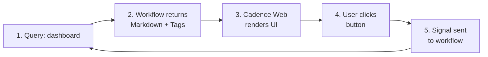
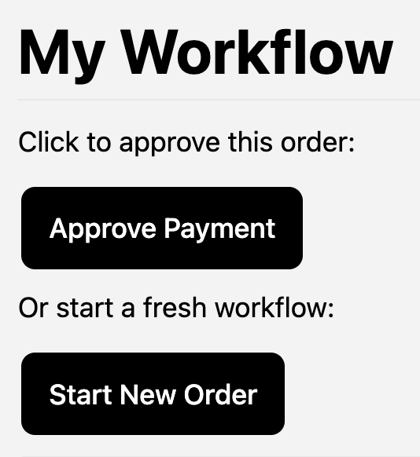
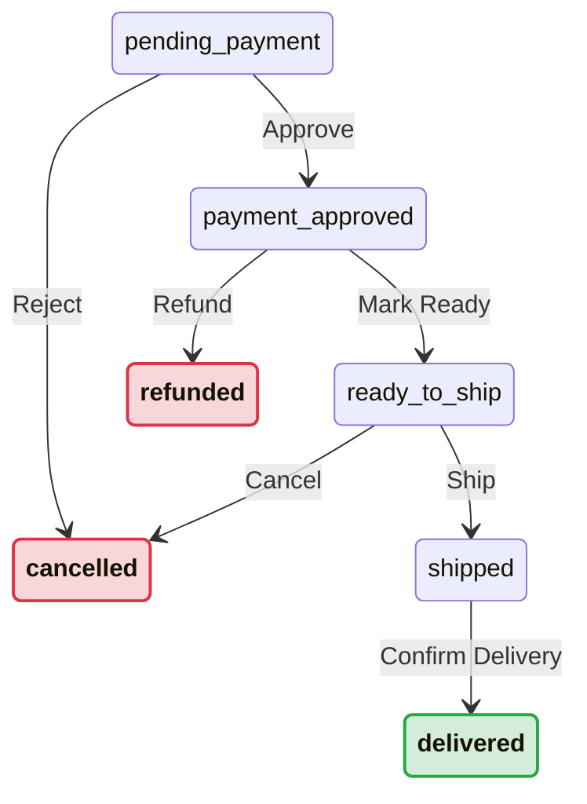

import Tabs from '@theme/Tabs';
import TabItem from '@theme/TabItem';

<iframe width="560" height="315" src="https://www.youtube.com/embed/SLlOk_BbtKo?si=YPL9F4ZM8ZlHlxh5" title="YouTube video player" frameborder="0" allow="accelerometer; autoplay; clipboard-write; encrypted-media; gyroscope; picture-in-picture; web-share" referrerpolicy="strict-origin-when-cross-origin" allowfullscreen></iframe>

### Introduction
Your workflow has internal state. What if your users could see it *and* act on it, directly from Cadence Web, without building a separate admin panel?


<details>
<summary>View the markdown source that produces this dashboard</summary>

```markdown
### ⚡ Available Actions

**Payment Review:**





```

</details>

Cadence Web renders **markdown** returned by workflow queries. Add three Markdoc tags ([``](#-signal-), [``](#-start-), [``](#-image-)) and your query response becomes a live ops dashboard. Below, we'll build one from scratch in three steps. See the full [Tag Reference](#tag-reference) for all attributes.

---

## How It Works



1. The user runs a **query** from the Cadence Web **Queries** tab
2. Your workflow returns **markdown with MarkDoc tags** in a special JSON shape
3. Cadence Web **renders** it: tables, text, images, and action buttons
4. The user clicks a button → Cadence Web sends a **signal** or starts a new workflow
5. The workflow state updates → next query shows the new state

---

## Response Format

Your query handler returns an object with this shape:

```json
{
  "cadenceResponseType": "formattedData",
  "format": "text/markdown",
  "data": "## Your markdown here\n\n"
}
```

| Field | Value |
|-------|-------|
| `cadenceResponseType` | Must be `"formattedData"` |
| `format` | Must be `"text/markdown"` |
| `data` | Your markdown string (supports MarkDoc tags) |

---

## Level 1: Return Markdown

The simplest case: return a markdown string from your query handler. Cadence Web renders it as formatted text instead of raw JSON.

<Tabs groupId="lang">
<TabItem value="go" label="Go">

```go
type markdownFormattedResponse struct {
	CadenceResponseType string `json:"cadenceResponseType"`
	Format              string `json:"format"`
	Data                string `json:"data"`
}

workflow.SetQueryHandler(ctx, "status", func() (markdownFormattedResponse, error) {
	md := fmt.Sprintf("## Order Status\n\n**Customer:** %s\n\n| Item | Qty |\n|------|-----|\n| %s | %d |",
		order.CustomerName, order.Items[0].Name, order.Items[0].Quantity)

	return markdownFormattedResponse{
		CadenceResponseType: "formattedData",
		Format:              "text/markdown",
		Data:                md,
	}, nil
})
```

</TabItem>
<TabItem value="java" label="Java">

```java
public class MarkdownFormattedResponse {
    private final String cadenceResponseType = "formattedData";
    private final String format = "text/markdown";
    private final String data;

    public MarkdownFormattedResponse(String markdownData) {
        this.data = markdownData;
    }
    public String getCadenceResponseType() { return cadenceResponseType; }
    public String getFormat() { return format; }
    public String getData() { return data; }
}

@QueryMethod(name = "status")
public MarkdownFormattedResponse statusQuery() {
    String md = String.format("## Order Status\n\n**Customer:** %s\n\n| Item | Qty |\n|------|-----|\n| %s | %d |",
        order.customerName, order.items[0].name, order.items[0].quantity);

    return new MarkdownFormattedResponse(md);
}
```

</TabItem>
</Tabs>

---

## Level 2: Beyond Plain Text

### Signal and Start Buttons

Add `` and `` tags to your markdown string. Cadence Web renders them as buttons that send real signals or start new workflows, without switching to the Cadence CLI or writing a separate client.

```markdown
## My Workflow

Click to approve this order:



Or start a fresh workflow:


```

<details>
<summary>View the rendered result in Cadence Web</summary>



</details>

### Sized Images

Standard markdown images (``) work, but offer no size control. The `` tag lets you set width and height. It also exists because Cadence Web strips raw HTML from query responses to prevent XSS, so `` tags in your markdown will not render.

```markdown

```

<details>
<summary>View the rendered result in Cadence Web</summary>


</details>

---

## Level 3: State-Driven Dashboards

The real power: **change which buttons appear** based on your workflow's current state.

The **OrderFulfillmentWorkflow** sample demonstrates this. An order moves through states, and the dashboard shows only the actions valid for the current state:



| State | Available Actions |
|-------|-------------------|
| Pending Payment | Approve Payment, Reject (Policy / Fraud / Customer Request) |
| Payment Approved | Mark Ready to Ship, Full Refund, Partial Refund |
| Ready to Ship | Ship via UPS / FedEx / USPS, Cancel Order |
| Shipped | Mark as Delivered |
| Delivered / Cancelled / Refunded | *No actions, order complete* |

The query handler builds the button list dynamically based on `order.Status`:

<Tabs groupId="lang">
<TabItem value="go" label="Go">

```go
func makeActionButtons(ctx workflow.Context, order Order) string {
	wfID := workflow.GetInfo(ctx).WorkflowExecution.ID
	runID := workflow.GetInfo(ctx).WorkflowExecution.RunID

	switch order.Status {
	case StatusPendingPayment:
		return fmt.Sprintf(`
{%% signal signalName="approve_payment" label="Approve Payment"
  domain="cadence-samples" cluster="cluster0"
  workflowId="%s" runId="%s" input={"operator":"ops-user"} /%%}
{%% signal signalName="reject_payment" label="Reject: Fraud Suspected"
  domain="cadence-samples" cluster="cluster0"
  workflowId="%s" runId="%s" input={"reason":"Fraud Suspected","operator":"ops-user"} /%%}
`, wfID, runID, wfID, runID)

	case StatusReadyToShip:
		return fmt.Sprintf(`
{%% signal signalName="ship_order" label="Ship via UPS"
  domain="cadence-samples" cluster="cluster0"
  workflowId="%s" runId="%s"
  input={"trackingNumber":"1Z999AA10123456784","carrier":"UPS","operator":"ops-user"} /%%}
`, wfID, runID)
	// ... other states
	}
	return "*No actions available*"
}
```

</TabItem>
<TabItem value="java" label="Java">

```java
private String makeActionButtons() {
    switch (order.status) {
        case STATUS_PENDING_PAYMENT:
            return sig("approve_payment", "Approve Payment",
                       "{\"operator\":\"ops-user\"}")
                 + sig("reject_payment", "Reject: Fraud Suspected",
                       "{\"reason\":\"Fraud Suspected\",\"operator\":\"ops-user\"}");
        case STATUS_READY_TO_SHIP:
            return sig("ship_order", "Ship via UPS",
                       "{\"trackingNumber\":\"1Z999AA10123456784\",\"carrier\":\"UPS\",\"operator\":\"ops-user\"}");
        // ... other states
    }
    return "*No actions available*";
}

private String sig(String signalName, String label, String input) {
    return "\n";
}
```

</TabItem>
</Tabs>

Each time the user clicks **Run** on the query, the dashboard reflects the latest workflow state with the appropriate actions.

---

## Tag Reference

### ``

Sends a signal to a running workflow.

| Attribute | Required | Description |
|-----------|----------|-------------|
| `signalName` | Yes | Signal type the workflow listens for |
| `label` | Yes | Button text |
| `domain` | Yes | Cadence domain |
| `cluster` | Yes | Cluster name configured in Cadence Web |
| `workflowId` | Yes | Target workflow execution ID |
| `runId` | Yes | Target workflow run ID |
| `input` | No | Signal payload: `true`, `false`, `"string"`, or `{"json":"object"}` |

### ``

Starts a new workflow execution.

| Attribute | Required | Description |
|-----------|----------|-------------|
| `workflowType` | Yes | Registered workflow type name |
| `label` | Yes | Button text |
| `domain` | Yes | Cadence domain |
| `cluster` | Yes | Cluster name configured in Cadence Web |
| `taskList` | Yes | Worker task list |
| `wfId` | No | Custom workflow ID |
| `input` | No | Workflow input |
| `timeoutSeconds` | No | Execution timeout in seconds |
| `sdkLanguage` | No | `"GO"` or `"JAVA"` |

### ``

Renders an image with optional size control. Standard markdown images (``) also work.

| Attribute | Required | Description |
|-----------|----------|-------------|
| `src` | Yes | Image URL |
| `alt` | Yes | Alt text |
| `width` | No | Width in pixels |
| `height` | No | Height in pixels |

---

## Sample Code

Full working examples in both Go and Java:

| Sample | Description | Go | Java |
|--------|-------------|----|------|
| **MarkdownQueryWorkflow** | Signals, start buttons, images | [Go source](https://github.com/cadence-workflow/cadence-samples/tree/master/new_samples/query/markdown_query.go) | [Java source](https://github.com/cadence-workflow/cadence-java-samples/tree/master/src/main/java/com/uber/cadence/samples/query/MarkdownQueryWorkflow.java) |
| **LunchVoteWorkflow** | Interactive voting with live results | [Go source](https://github.com/cadence-workflow/cadence-samples/tree/master/new_samples/query/lunch_vote_workflow.go) | [Java source](https://github.com/cadence-workflow/cadence-java-samples/tree/master/src/main/java/com/uber/cadence/samples/query/LunchVoteWorkflow.java) |
| **OrderFulfillmentWorkflow** | Full ops dashboard with state machine | [Go source](https://github.com/cadence-workflow/cadence-samples/tree/master/new_samples/query/order_fulfillment_workflow.go) | [Java source](https://github.com/cadence-workflow/cadence-java-samples/tree/master/src/main/java/com/uber/cadence/samples/query/OrderFulfillmentWorkflow.java) |

:::note
Requires **Cadence Web v4.0.14+** for MarkDoc rendering support.
:::
