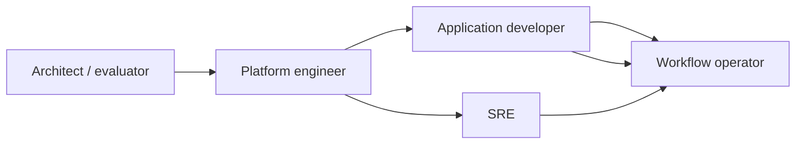

Cadence exposes different interfaces depending on what you are trying to do. Application developers spend most of their time in SDKs and tests. Platform engineers and SREs work through deployment manifests, configuration, and observability tools. Workflow operators use the Web UI and CLI to **run and operate product workflows** (backfills, data fixes, approvals, and similar), whether they are starting a new run, responding to an issue, checking status, or collecting data.

This page describes **how each [persona](/docs/tech-review/day-0-planning/scope/target-personas) interacts with Cadence** and how those roles collaborate across a typical adoption lifecycle.

## Cadence surfaces by persona

| Persona | Primary interfaces | Typical cadence |
| --- | --- | --- |
| Application developer | Language SDKs, unit/replay tests, worker processes | Daily during feature work |
| Platform engineer | Helm charts, vendor APIs, internal portals, static/dynamic config, admin CLI | Weekly during rollout; ongoing for onboarding and tooling |
| SRE | Prometheus/Grafana (or equivalent), alerts, runbooks, upgrade playbooks | Continuous in production |
| Workflow operator | Cadence Web UI, `cadence` CLI workflow commands | When running backfills or fixes; during incidents, support tickets, or routine inspection |
| Architect | Docs, local quickstart, POC clusters | During evaluation and standards definition |

Conceptual background: [Topology](/docs/concepts/topology), [Workflow engine concepts](/docs/concepts/workflow-engine).

## How personas work together

Most successful deployments separate **who writes workflow code** from **who runs the Cadence cluster**. Application teams own business logic and worker deployments; a platform, SRE, or infrastructure team owns the shared Cadence service, persistence, and baseline observability.

In many companies the **SRE team fills both the platform and SRE personas**: they install Cadence, offer it as an internal service to dev teams, and stay on call for production health.

### Phase 1: Evaluation

An **architect or senior developer** reads [primary use cases](/docs/tech-review/day-0-planning/scope/primary-use-cases) and runs the [local quickstart](/docs/get-started/). The goal is to validate that Cadence's programming model fits the target problem (long-running logic, retries, signals, visibility) better than queues and cron alone.

Deliverables: a short recommendation, a reference workflow for the hardest use case, and a rough sense of domain and worker topology.

### Phase 2: Platform bootstrap

A **platform engineer or SRE team** makes Cadence available to the company: provisioning a self-hosted cluster, contracting a managed offering, or both. They create domains, configure persistence and visibility (or integrate with the vendor's setup), wire metrics into the org monitoring stack, and build internal tooling so application teams can onboard without bespoke setup. They document naming conventions, domain request process, and resource expectations for new teams.

Deliverables: a production or staging cluster, domain templates, and a "hello workflow" path for onboarding application teams.

### Phase 3: Application onboarding

**Application developers** implement workflows and activities, register workers against agreed task lists, and use SDK testing tools before merging. They rely on the platform team for domain credentials, cluster endpoints, and observability dashboards, not for writing business logic.

Deliverables: worker services in the application's deployment pipeline, integration tests, and runbooks for worker scaling.

### Phase 4: Production operations

**SREs** monitor Cadence service health, persistence latency, and cross-domain isolation. **Workflow operators** (often support, business ops, or application on-call) use the Web UI or CLI to **start** operator-facing workflows or work with runs already in progress: backfills, customer data fixes, status queries, signals, resets, and batch operations when runbooks allow. **Application developers** are pulled in when failures indicate a code bug, versioning issue, or non-deterministic change, or when operators need a new workflow type or runbook.

Deliverables: alert thresholds, escalation paths, and documented break-glass procedures for operational workflow actions.

### Smaller teams

In startups or single-service organizations, one engineer may cover architect, developer, and operator roles. Cadence still separates **worker code** from **server operations**, but the same person may manage both until the deployment grows.

Mid-size companies often consolidate server operations under an **SRE team** that installs Cadence once and supports many application teams as an internal platform.

## Interaction details by persona

### Application developer

**Goals:** implement durable business processes in ordinary code; ship confidently with tests.

**Typical tasks:**

- Define workflow and activity functions in the [Go](/docs/go-client), [Java](/docs/java-client/client-overview), or [Python client](/docs/python-client/workers) SDK.
- Register workers and poll the task lists assigned by the platform team.
- Use [workflow replay and testing](/docs/codelabs/workflow-tests-go-replayer-shadower) to catch incompatible code changes.
- Start workflows from application services via SDK or gRPC APIs.
- Publish **operator-ready workflows** and runbooks (allowed start types, inputs, signals, escalation paths) for teams that run work through the Web UI or CLI.

**Usually delegated elsewhere:** Cassandra/MySQL/Postgres schema management, Cadence server upgrades, cluster-wide dynamic config.

**Hands off to:** platform engineer (capacity, new domains), workflow operator (approved workflows and runbooks for production operations without a code deploy).

### Platform engineer

**Goals:** make Cadence a dependable, easy-to-consume internal platform with clear boundaries between teams.

Platform engineers do not always run Cadence servers themselves. A company may **buy managed Cadence from a vendor** while an internal platform team still owns adoption: wrapping provisioning in company tooling, standardizing SDK and worker templates, connecting Cadence to CI/CD and observability, and defining how teams request domains and credentials.

In other organizations an **SRE team performs this role** end to end, including cluster install and operations. Larger orgs may split platform engineering (developer experience and tooling) from SRE (production health and capacity).

**Typical tasks:**

- Stand up Cadence via [self-hosted install](/docs/get-started/server-installation) or integrate a **managed offering** into the internal platform.
- Build bridges to company systems: developer portals, deployment pipelines, auth, metrics, and runbooks for requesting domains and task lists.
- Create and govern **domains** (tenancy boundaries) and advise teams on task list layout.
- Tune [dynamic configuration](/docs/operation-guide/setup) for rate limits, visibility, and multitenancy (where the deployment model allows).
- Integrate Cadence metrics and workflow visibility with org-standard dashboards.

**Usually delegated elsewhere:** individual workflow business logic, per-workflow debugging in application code.

**Hands off to:** application developers (worker deployment and workflow definitions), SREs (ongoing alert response and capacity planning at scale, when roles are split).

### Site reliability engineer (SRE)

**Goals:** meet availability and latency targets for the shared Cadence platform; contain blast radius across domains.

At many companies SREs are also the team that **bootstraps Cadence and offers it as a service** to application developers, not only the team that responds to alerts after go-live.

**Typical tasks:**

- Install and upgrade Cadence using [Docker](/docs/get-started/server-installation), [Helm](/docs/get-started/grafana-helm-setup), or vendor-managed options (often owned by the same SRE team that runs production).
- Define SLIs/SLOs on history, matching, and frontend services using [monitoring](/docs/operation-guide/monitoring) signals.
- Run upgrade and rollback procedures documented in the [operation guide](/docs/operation-guide/maintain).
- Investigate persistence saturation, noisy-neighbor domains, and worker backlog growth.
- Partner with FinOps on database and storage cost trends.

**Hands off to:** platform engineer (config or topology changes), application teams (worker scaling or hot task lists tied to a specific service).

### Workflow operator

**Goals:** use product workflows as operational tools to get work done safely through Cadence's built-in UI and CLI, without redeploying application code.

Workflow operators work on **business workflows** (what the product team shipped), not Cadence cluster internals. A workflow is often the **means to an end**: run a backfill, correct customer data, reprocess a batch, or unblock a case. They are the **customer** of **application developers**, who provide the workflow definitions, worker coverage, and runbooks, and of the **Cadence Web UI and CLI**, which let them start runs and take approved actions on executions.

**Typical tasks:**

- **Start** approved workflow runs from the Web UI or [CLI](/docs/cli/) (`workflow start`, `workflow run`) using inputs and workflow types documented by the application team.
- Search and filter executions (`workflow list`, `workflow show`, history views).
- Run **queries** to read workflow state for inspection or data collection.
- Send **signals** to nudge or unblock a workflow when runbooks allow it.
- Apply approved remediations: reset, terminate, cancel, or batch operations across many executions.
- Escalate to developers when a needed workflow type is missing, inputs are unclear, or history indicates a code, versioning, or non-determinism defect.

**Usually delegated elsewhere:** changing workflow definitions, deploying new worker binaries, cluster or persistence changes.

**Hands off to:** application developer (new operator workflow, runbook update, bug fix, or versioning change), SRE (cluster-wide outage or persistence failure).

### Architect / technical evaluator

**Goals:** decide fit, set adoption standards, and avoid using Cadence where simpler tools suffice.

**Typical tasks:**

- Map candidate workloads to [primary use cases](/docs/tech-review/day-0-planning/scope/primary-use-cases).
- Define when new services should use Cadence versus synchronous APIs or message queues only.
- Review security, data residency, and operational ownership before wide rollout.

**Hands off to:** platform engineer (build vs buy, cluster strategy), application teams (POC implementation).

## Common handoffs

| From | To | Typical trigger |
| --- | --- | --- |
| Architect | Platform engineer | Decision to pilot or standardize on Cadence |
| Platform engineer | Application developer | Domain and cluster ready for worker registration |
| Application developer | Workflow operator | Operator-ready workflows and runbooks published |
| Application developer | Workflow operator | Production workflow stuck, needs signal or inspection |
| Workflow operator | Application developer | Need a new workflow type, runbook, or fix for a logic or versioning defect |
| SRE | Platform engineer | Cluster config change needed (shards, limits, isolation) |
| Any persona | Maintainers / community | Product question, bug report, or feature gap |

## Getting help

Documentation is organized by task and persona on [cadenceworkflow.io](https://cadenceworkflow.io). When docs are not enough:

- [Contact us](https://cadenceworkflow.io/community/contact-us)
- [CNCF Slack `#cadence-users`](https://inviter.co/cncf) for questions and discussion
- [GitHub Issues](https://github.com/cadence-workflow/cadence/issues) for defects and feature requests
- [Community meetups](/community/meetup) for live Q&A with maintainers

## Related documentation

- [Target personas](/docs/tech-review/day-0-planning/scope/target-personas)
- [UX & UI](/docs/tech-review/day-0-planning/usability/ux-ui)
- [Production integrations](/docs/tech-review/day-0-planning/usability/production-integrations)
- [Use cases](/docs/use-cases/)
