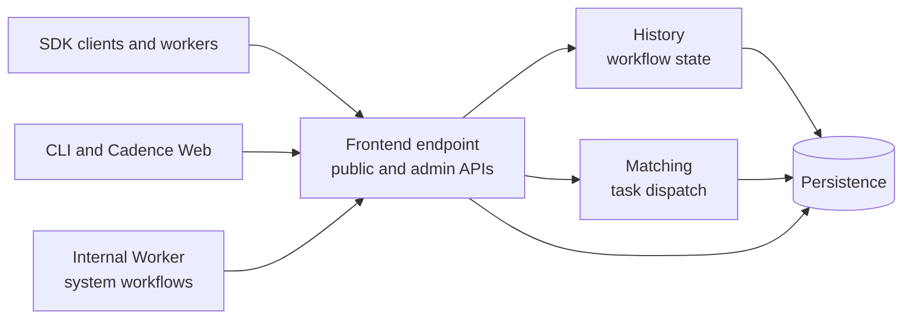

Cadence exposes a versioned workflow API through its Frontend service. Language SDKs are the usual application interface, while the CLI, Cadence Web, and direct gRPC integrations use the same underlying contract. The source of truth is [cadence-idl](https://github.com/cadence-workflow/cadence-idl).

Cadence is a standalone workflow service. Clients reach it through Frontend's own network API, and it keeps workflow state in its own persistence store. The same server image runs on Kubernetes, another scheduler, or a virtual machine.

## API topology

Application clients, workers, the CLI, and Cadence Web connect to a **Frontend** endpoint. That endpoint can be a single Frontend instance or an address that distributes traffic across several instances. Frontend authenticates and rate-limits the request, routes it to the service that owns the operation, and maps the result back to the public wire type.

The Frontend in server v1.4.1 exposes the following Protobuf services from the IDL revision pinned by that release. The links in this table use that immutable revision so they continue to match v1.4.1. See the [`master` branch](https://github.com/cadence-workflow/cadence-idl/tree/master/proto/uber/cadence) for the latest IDL, which can include APIs that have not reached a server release.

| Service | Callers and scope |
| --- | --- |
| [`WorkflowAPI`](https://github.com/cadence-workflow/cadence-idl/blob/3ee08a98cf704ed8b2cc2101abe71ab80eccf542/proto/uber/cadence/api/v1/service_workflow.proto) | Starters and operators start, signal, query, cancel, terminate, reset, describe, and inspect workflow executions |
| [`WorkerAPI`](https://github.com/cadence-workflow/cadence-idl/blob/3ee08a98cf704ed8b2cc2101abe71ab80eccf542/proto/uber/cadence/api/v1/service_worker.proto) | SDK workers long-poll for decision and activity tasks, report results, and send activity heartbeats |
| [`VisibilityAPI`](https://github.com/cadence-workflow/cadence-idl/blob/3ee08a98cf704ed8b2cc2101abe71ab80eccf542/proto/uber/cadence/api/v1/service_visibility.proto) | Clients and operators list, scan, and count workflow executions, including archived executions |
| [`DomainAPI`](https://github.com/cadence-workflow/cadence-idl/blob/3ee08a98cf704ed8b2cc2101abe71ab80eccf542/proto/uber/cadence/api/v1/service_domain.proto) | Operators register, describe, update, deprecate, delete, and fail over domains |
| [`ScheduleAPI`](https://github.com/cadence-workflow/cadence-idl/blob/3ee08a98cf704ed8b2cc2101abe71ab80eccf542/proto/uber/cadence/api/v1/service_schedule.proto) | Clients and operators create, update, pause, backfill, describe, list, and delete schedules |
| [`MetaAPI`](https://github.com/cadence-workflow/cadence-idl/blob/3ee08a98cf704ed8b2cc2101abe71ab80eccf542/proto/uber/cadence/api/v1/service_meta.proto) | Load balancers and operators check Frontend health |

The [`AdminAPI`](https://github.com/cadence-workflow/cadence-idl/blob/3ee08a98cf704ed8b2cc2101abe71ab80eccf542/proto/uber/cadence/admin/v1/service.proto) is served by Frontend but is a separate operator surface. It exposes shard, queue, replication, cluster, and dynamic-configuration operations. Keep it behind an operator access boundary rather than exposing it as an application endpoint.

Server v1.4.1 serves Protobuf over gRPC on port `7833` and legacy Thrift over TChannel on port `7933` in the [supplied configuration](https://github.com/cadence-workflow/cadence/blob/v1.4.1/config/development.yaml). RPC TLS applies only to the gRPC listener. The TChannel listener stays plaintext because TChannel and Thrift are the legacy path the project intends to deprecate, not because TLS is incompatible with that transport. That listener shares its channel with Ringpop, the membership layer, so enabling TLS there would also encrypt membership traffic and every peer in the ring would need to use it. Both transports enter the same internal handler and the same [Frontend wrapper chain](https://github.com/cadence-workflow/cadence/tree/v1.4.1/service/frontend/wrappers) for authorization, metrics, rate limiting, cluster redirection, and optional client-version checks. The [HTTP/JSON API](/docs/concepts/http-api) is opt-in. When enabled, it exposes only the procedures listed in static configuration and uses the same Protobuf request and response shapes. It is an RPC-over-HTTP interface, not a separate REST resource model.

History and Matching also have RPC listeners for communication among Cadence services. Those listeners are internal implementation APIs and should not be exposed to application clients. See [Deployment topology](/docs/concepts/topology) and [Architecture requirements](/docs/tech-review/day-0-planning/design/architecture-requirements).

## API conventions

The public Protobuf contract follows these conventions:

- Public types are in `uber.cadence.api.v1`; administrative types are in `uber.cadence.admin.v1`. The `v1` is the wire-API version, not the Cadence server release.
- Services are split by concern and caller. RPC names use `VerbNoun`, and every RPC has a dedicated `VerbNounRequest` and `VerbNounResponse` message.
- Protobuf fields use `snake_case` and stable numeric field identifiers. Time values use Protobuf `Duration` and `Timestamp` types. Workflow input and results use an opaque `Payload`; language SDK data converters own the application encoding.
- Retriable mutating requests include a `request_id` where the operation needs deduplication, such as starting or signaling a workflow.
- Paginated list APIs generally use a requested page size and an opaque `next_page_token`. Callers must return the token unchanged and must not parse it. A few bounded listings return their full result, and some AdminAPI operations use a page identifier instead.
- Errors use a transport status code and a typed Protobuf detail from [`error.proto`](https://github.com/cadence-workflow/cadence-idl/blob/3ee08a98cf704ed8b2cc2101abe71ab80eccf542/proto/uber/cadence/api/v1/error.proto). SDKs map those details to language-specific error types.
- Application code normally uses an SDK rather than generated RPC stubs. SDKs provide deterministic workflow primitives and replay, serialize payloads, long-poll for tasks, heartbeat activities, and map wire errors into the language API.

The legacy Thrift contract remains in [`thrift/`](https://github.com/cadence-workflow/cadence-idl/tree/3ee08a98cf704ed8b2cc2101abe71ab80eccf542/thrift). The server maps Thrift and Protobuf requests into one internal type system. Java SDK 4.x uses gRPC only; removing TChannel from that SDK did not remove the server's compatibility endpoint. The project intends to deprecate TChannel and Thrift usage. New clients should use Protobuf over gRPC.

## Defaults

Installing Cadence does not change an existing application's behavior. A workload begins using Cadence only after its code connects through an SDK and sends requests to a registered domain.

The important API defaults in server v1.4.1 and its project-maintained deployment configurations are:

| Area | Default behavior |
| --- | --- |
| Inbound transports | Frontend [gRPC and Thrift listeners](https://github.com/cadence-workflow/cadence/blob/v1.4.1/config/development.yaml#L29-L31) are configured; [HTTP/JSON](https://github.com/cadence-workflow/cadence/blob/v1.4.1/common/config/config.go#L165-L166) is opt-in |
| Transport security | Plaintext unless [TLS or mTLS](https://github.com/cadence-workflow/cadence/blob/v1.4.1/common/config/config.go#L163) is configured. RPC TLS applies only to the gRPC listener; the Thrift/TChannel port stays plaintext |
| Authorization | The [no-op authorizer](https://github.com/cadence-workflow/cadence/blob/v1.4.1/common/authorization/factory.go#L29-L35) permits requests unless an authorizer is configured |
| Visibility | Basic visibility uses a [database-backed visibility store](https://github.com/cadence-workflow/cadence/blob/v1.4.1/common/config/config.go#L196-L198), which can be the same database as primary persistence; [advanced visibility](https://github.com/cadence-workflow/cadence/blob/v1.4.1/docker/config_template.yaml#L9-L12) is opt-in |
| Workflow retention | Registration chooses how long closed workflow history is kept after the workflow is closed. The domain record stays. Compiled bounds are [1 through 30 days](https://github.com/cadence-workflow/cadence/blob/v1.4.1/common/dynamicconfig/dynamicproperties/constants.go#L3512-L3520); the [Docker](https://github.com/cadence-workflow/cadence/blob/v1.4.1/config/dynamicconfig/development.yaml#L4-L6) and [Helm](https://github.com/cadence-workflow/cadence-charts/blob/cadence-1.6.7/charts/cadence/values.yaml#L1250-L1252) dynamic configuration lowers the minimum to 0 |
| History pages | A history page defaults to [1000 events](https://github.com/cadence-workflow/cadence/blob/v1.4.1/common/dynamicconfig/dynamicproperties/constants.go#L3678-L3682), the server [caps it at 1000](https://github.com/cadence-workflow/cadence/blob/v1.4.1/service/frontend/api/handler.go#L1865-L1872), and configuration can only lower it |
| Event payload size | Warn at [256 KiB](https://github.com/cadence-workflow/cadence/blob/v1.4.1/common/dynamicconfig/dynamicproperties/constants.go#L3532-L3536) and reject at [2 MiB](https://github.com/cadence-workflow/cadence/blob/v1.4.1/common/dynamicconfig/dynamicproperties/constants.go#L3527-L3530) |
| Identifier length | Domain names, workflow IDs, task-list names, and most other identifiers have a [1000-character error limit](https://github.com/cadence-workflow/cadence/blob/v1.4.1/common/constants/constants.go#L142-L143) |
| Frontend user traffic | [`frontend.rps`](https://github.com/cadence-workflow/cadence/blob/v1.4.1/common/dynamicconfig/dynamicproperties/constants.go#L3684-L3687) permits 1200 user requests per second per Frontend instance |

The numeric limits above are compiled server defaults unless the row names a package override. Helm values and container entrypoints can render different static and dynamic configuration. The authoritative compiled key names, values, and filters are in [`constants.go`](https://github.com/cadence-workflow/cadence/blob/v1.4.1/common/dynamicconfig/dynamicproperties/constants.go). See [Default behaviors and overrides](/docs/tech-review/day-1-installation/enablement-rollback/default-behaviors) for the SDK, domain, Helm, Docker, and optional-feature defaults.

## Configuration needed for useful operation

A minimal local installation can use the bundled SQLite configuration. A shared or production cluster needs the following before it can execute application work:

1. **Configure and initialize persistence.** Choose Cassandra, MySQL, or PostgreSQL, create the Cadence schemas, and point each server role at the store. Basic visibility can use the same database.
2. **Start the server roles.** Run Frontend, History, Matching, and the internal Worker, either together for development or as independently scaled processes.
3. **Register a domain.** Supply a name and history-retention period. A Kubernetes namespace does not create or configure a Cadence domain.
4. **Run application workers.** Deploy workflow and activity implementations through a language SDK. Workers connect to Frontend and poll an application-selected task list.
5. **Start work through the API.** The starter selects the domain, workflow type, task list, workflow ID policy, and timeouts. Cadence then persists history and dispatches tasks to workers.

Before production traffic, configure TLS or mTLS on the gRPC listener. RPC TLS applies only to that listener; the Thrift/TChannel port stays plaintext. If the HTTP endpoint is enabled, configure its TLS separately. Disable the plaintext TChannel port or keep it off the network. Also replace the no-op authorizer when access control is required, run redundant service instances, enable metrics, set history shard count before creating the cluster, and review rate limits and payload limits. Advanced visibility, archival, schedules, multi-cluster replication, and the HTTP endpoint remain independent opt-ins. See [Installation and initialization](/docs/tech-review/day-0-planning/installation/installation-initialization) and [Production integrations](/docs/tech-review/day-0-planning/usability/production-integrations).

Static YAML configures listeners, persistence clients, TLS, authorization, and provider clients at process startup. [Dynamic configuration](/docs/operation-guide/setup#dynamic-configuration) changes runtime limits and feature switches globally or under supported domain, task-list, task-type, shard, cluster, or rate-limit filters. A dynamic value cannot create a datastore, listener, or cloud client that is absent from static configuration.

## APIs and external calls introduced by enablement

Core Cadence adds its own API endpoint and persistence traffic. It does not modify an existing application's API, provision cloud resources, or call a cloud control plane. Optional features add only the calls listed below.

| Enabled surface | New types or calls |
| --- | --- |
| [Core server](https://github.com/cadence-workflow/cadence-idl/tree/3ee08a98cf704ed8b2cc2101abe71ab80eccf542/proto/uber/cadence) | Frontend serves the Cadence `v1` workflow and admin RPCs. Server roles use internal RPCs and read and write the configured persistence database |
| [Application workers](https://github.com/cadence-workflow/cadence-idl/blob/3ee08a98cf704ed8b2cc2101abe71ab80eccf542/proto/uber/cadence/api/v1/service_worker.proto) | SDK workers long-poll `WorkerAPI`, complete decision and activity tasks, and send heartbeats. Activities may call any external service, but those calls belong to application code, not to Cadence |
| [HTTP/JSON](https://github.com/cadence-workflow/cadence/blob/v1.4.1/common/config/config.go#L169-L174) | Frontend opens the configured HTTP port and accepts only the allow-listed Cadence RPC procedures. It does not add a second set of API types |
| [Advanced visibility](https://github.com/cadence-workflow/cadence/blob/v1.4.1/config/development_es_opensearch.yaml#L1-L16) | Cadence publishes visibility records to Kafka and the internal Worker writes and queries Elasticsearch, OpenSearch, or [Pinot](https://github.com/cadence-workflow/cadence/blob/v1.4.1/config/development_pinot.yaml#L1-L20) |
| [AWS-signed visibility](https://github.com/cadence-workflow/cadence/blob/v1.4.1/common/config/elasticsearch.go#L53-L71) | When AWS request signing is enabled for a managed search endpoint, the search client signs its HTTP requests and can obtain credentials through the configured AWS credential provider |
| [Async workflow APIs](https://github.com/cadence-workflow/cadence/blob/v1.4.1/service/frontend/api/handler.go#L1599-L1645) | Frontend publishes supported asynchronous start or signal requests to Kafka for later consumption |
| [S3 archival](https://github.com/cadence-workflow/cadence/blob/v1.4.1/common/archiver/s3store/README.md) | Cadence validates the configured bucket or access point and reads, writes, and lists archived history and visibility objects through the AWS SDK. It does not create the bucket |
| [Google Cloud Storage archival](https://github.com/cadence-workflow/cadence/blob/v1.4.1/common/archiver/gcloud/README.md) | Cadence checks the configured bucket and reads, writes, and lists archive objects through the Cloud Storage client. The bucket must already exist |
| [OAuth authorization](https://github.com/cadence-workflow/cadence/blob/v1.4.1/common/authorization/oauthAuthorizer.go#L78-L111) | The authorizer validates JWTs locally against a configured public key. When a JWKS URL is configured, it fetches the key set over HTTP at startup |
| [Metrics](https://github.com/cadence-workflow/cadence/blob/v1.4.1/common/config/config.go#L467-L478) | Prometheus scrapes the configured endpoint; StatsD and M3 reporters send metrics to their configured collectors |
| [Helm Cloud SQL proxy](https://github.com/cadence-workflow/cadence-charts/blob/cadence-1.6.7/charts/cadence/values.yaml#L588-L593) | The optional proxy sidecar calls Google Cloud APIs for database authentication. The Cadence server process does not make those calls |

Core workflow execution makes no cloud-provider calls. Archival is the server feature that directly reads and writes public-cloud object storage; its providers and credential requirements are documented with the [S3](https://github.com/cadence-workflow/cadence/blob/v1.4.1/common/archiver/s3store/README.md) and [Google Cloud Storage](https://github.com/cadence-workflow/cadence/blob/v1.4.1/common/archiver/gcloud/README.md) implementations. Running a datastore or search service on a cloud does not cause Cadence to create or manage that service through the provider's control-plane API.

## Kubernetes API compatibility

The Cadence server serves the Frontend RPC API and talks to the persistence store configured for the cluster. The same image runs on Kubernetes, another scheduler, or a virtual machine. Kubernetes API use belongs to deployment tooling: the official Helm chart creates the workload objects that run those processes.

[Chart `1.6.7`](https://github.com/cadence-workflow/cadence-charts/blob/cadence-1.6.7/charts/cadence/Chart.yaml), which packages server v1.4.1, declares Kubernetes `>=1.29.0-0` and renders standard APIs such as `apps/v1` Deployments, `v1` Services, ConfigMaps, Secrets and ServiceAccounts, and `batch/v1` schema Jobs. Optional values can add `autoscaling/v2` HorizontalPodAutoscalers, `networking.k8s.io/v1` NetworkPolicies, `policy/v1` disruption budgets, and RBAC objects. The chart creates a ServiceAccount by default and leaves its optional ClusterRole and ClusterRoleBinding off.

`ServiceMonitor` and Google `PodMonitoring` objects are also optional and default off. Enabling either requires that API to already be installed in the target cluster. See the [released chart templates](https://github.com/cadence-workflow/cadence-charts/tree/cadence-1.6.7/charts/cadence/templates) and [Infrastructure compatibility](/docs/tech-review/day-1-installation/rollout-upgrade-rollback/infrastructure-compatibility).

Kubernetes version compatibility follows the chart. The Cadence RPC API stays the same across schedulers, and domains, workflows, activities, task lists, and schedules are records in Cadence persistence.

## API versioning and breaking changes

The public Protobuf package and Admin package are both at `v1`. New Cadence server releases do not create a new API package for each release. The server, Go SDK, Java SDK, Python SDK, Web UI, and Helm chart have independent semantic versions and release schedules. Each component pins or generates from a known IDL revision.

The default branch of cadence-idl can contain APIs that are not in the latest server release. Use the IDL revision pinned by the server or SDK version you deploy when determining which RPCs are available.

Compatible API evolution is additive:

- Add a new RPC or message.
- Add a field with a new numeric identifier and a default that preserves existing behavior.
- Keep existing field numbers and wire types unchanged.
- Let old clients ignore unknown response fields and let new servers treat absent request fields as their default.
- Deploy the server before using a newly added RPC from a newer client. An old server cannot implement an RPC it does not know.

The [cadence-idl pull-request template](https://github.com/cadence-workflow/cadence-idl/blob/master/.github/pull_request_template.md) asks contributors to describe backward and forward compatibility, data effects, tests, rollout order, rollback safety, and any kill switch. [IDL CI](https://github.com/cadence-workflow/cadence-idl/blob/master/.github/workflows/ci.yml) runs Buf lint, regenerates checked-in Go bindings, and compiles the Thrift files. The current workflow does not run an automated `buf breaking` comparison, so compatibility analysis and review remain required.

When a surface can remain available, Cadence marks it deprecated, adds the replacement, keeps both paths during migration, and announces removal in release notes or a migration guide. Protobuf fields use `[deprecated = true]`; SDKs use their language-level deprecation marker. A wire-incompatible change must not silently replace a released `v1` field or reuse its number. Follow the affected component's release notes for the exact compatibility boundary, because a server major version and an SDK major version do not imply the same change.

The server also receives SDK implementation, feature-version, and feature-flag headers. It uses them for features whose response or error shape requires client support. [General rejection of unsupported SDK versions](https://github.com/cadence-workflow/cadence/blob/v1.4.1/common/client/versionChecker.go) through `frontend.enableClientVersionCheck` has a compiled default of `false`; a deployment package can override it through dynamic configuration. Operators should still follow the tested server and SDK combinations in release notes.

Workflow-code versioning is separate from wire-API versioning. A Protobuf-compatible API change does not make a non-deterministic workflow-code change safe for an execution whose history already exists. Use [workflow versioning](/docs/go-client/workflow-versioning) and replay tests for those application changes.

## Related documentation

- [Default behaviors and overrides](/docs/tech-review/day-1-installation/enablement-rollback/default-behaviors)
- [Deprecations and removals](/docs/tech-review/day-1-installation/rollout-upgrade-rollback/deprecations)
- [Infrastructure compatibility](/docs/tech-review/day-1-installation/rollout-upgrade-rollback/infrastructure-compatibility)
- [Architecture requirements](/docs/tech-review/day-0-planning/design/architecture-requirements)
- [Deployment topology](/docs/concepts/topology)
- [Production integrations](/docs/tech-review/day-0-planning/usability/production-integrations)
- [Mutual TLS](/docs/concepts/mutual-tls)
- [Data converter](/docs/concepts/data-converter)
- [Go workers](/docs/go-client/workers), [Java client](/docs/java-client/starting-workflow-executions), [Python client](/docs/python-client/index)
- [CLI](/docs/cli)
